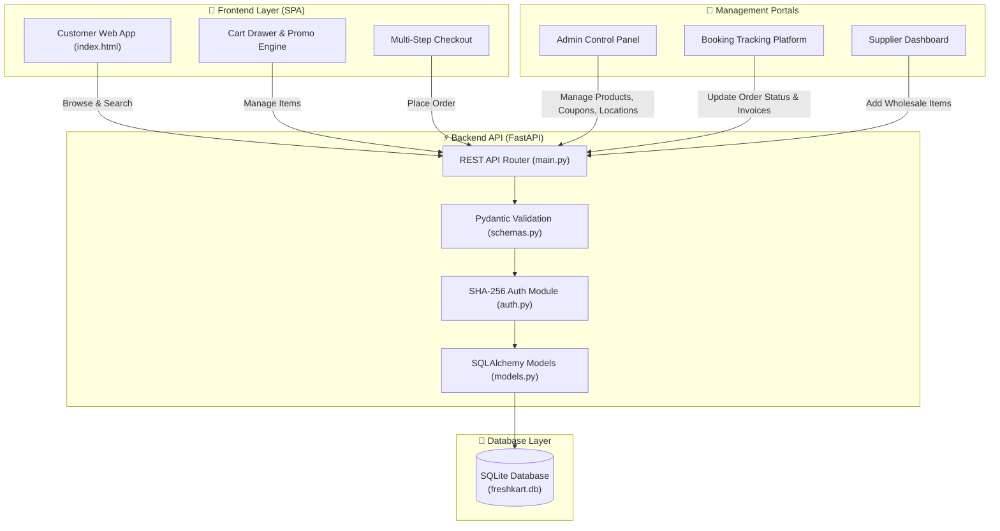

# 🛒 FreshKart 1 — System Flow, Architecture & Admin Management Manual

Welcome to **FreshKart 1** (Apni Digital Kirana Dukan). This document provides a complete overview of the project flow, technical architecture, and a step-by-step manual on how to manage all administrative features.

---

## 🖼️ 1. Project Workflow & Architecture Diagram

A high-resolution infographic diagram has been created and saved directly in your project folder at:
👉 [`freshkart_project_flow.jpg`](file:///C:/Users/lalkr/OneDrive/Desktop/freshkart1-main/freshkart_project_flow.jpg)

### 📊 System Workflow Overview


---

## 📊 2. PowerPoint Presentation (.pptx)

A 10-slide PowerPoint presentation has been generated and saved in your project directory at:
👉 [`FreshKart1_Project_Guide_and_Admin_Manual.pptx`](file:///C:/Users/lalkr/OneDrive/Desktop/freshkart1-main/FreshKart1_Project_Guide_and_Admin_Manual.pptx)

### 📄 Slide Breakdown
1. **Title Slide**: FreshKart 1 Project Overview & Guide
2. **Executive Overview**: System purpose, business goals & target audience
3. **Technology Stack**: FastAPI, SQLite, SQLAlchemy, Vanilla HTML5/CSS3/ES6 JS
4. **End-to-End Workflow**: Customer shopping journey to Admin fulfillment
5. **Admin Guide — Part 1**: Product & Supplier management
6. **Admin Guide — Part 2**: Discount Coupons, Serviceable Locations & User Management
7. **Admin Guide — Part 3**: Booking Tracking Platform & PDF Invoicing
8. **Credentials Matrix**: Pre-configured accounts for testing
9. **Deployment & Startup**: Local Uvicorn server and Render Cloud deployment instructions
10. **Conclusion & Summary**

---

## 🔑 3. Pre-Configured Test Credentials

| Role | Username | Password | Privileges |
| :--- | :--- | :--- | :--- |
| **System Admin** | `yashpatil` | `12528289Yash@` | Full access to Admin Panel, Products, Suppliers, Orders, Coupons, Locations |
| **Admin** | `admin` | `admin123` | Full admin privileges & Order Tracking |
| **Supplier** | `supplier` | `supplier123` | Supplier Dashboard, Product Creation & Company Order Tracking |

---

## 🛠️ 4. Step-by-Step Admin Management Guide

### A. Managing Products & Inventory
1. Log in using `yashpatil` or `admin`.
2. Click **Admin Panel** in the top control bar.
3. **Add New Item**:
   - Fill in Title (e.g. *Fortune Sunlite Sunflower Oil*).
   - Select Category (*staples*, *oil*, *dairy*, *vegetables*, *tea*, *snacks*).
   - Enter Price and Original Price (discount badge is auto-calculated).
   - Provide image URL, unit (e.g. *1 Litre Pouch*), and description.
   - Click **Save Product**.
4. **Edit / Delete Item**:
   - Locate the item on the store grid and click the **Pencil Icon** to edit or **Trash Icon** to delete.

### B. Managing Discount Coupons
1. Open **Admin Panel** -> **Manage Discount Coupons**.
2. **Create Coupon**:
   - Enter Code (e.g. `FRESH10`).
   - Enter Discount Percentage (e.g. `10`).
   - Set Minimum Order amount (e.g. `250`).
   - Select Target Audience (*Everyone* or *Specific User*).
3. Click **Create Coupon**. Active coupons take effect immediately during checkout.

### C. Managing Serviceable Cities & Pincodes
1. Open **Admin Panel** -> **Manage Serviceable Pincodes**.
2. **Add Location**:
   - Enter Area/City Name (e.g. *Savda* or *Mumbai*).
   - Enter 6-digit Pincode (e.g. *425502* or *400001*).
3. Locations auto-populate on checkout. Delivery requests to non-configured pincodes are blocked.

### D. Order Tracking & Status Updates
1. Click **Track Bookings** in the management toolbar.
2. Search by **Order ID**, **Customer Name**, or **Phone Number**.
3. Change order status via dropdown:
   - `Placed` ➔ `Packing` ➔ `Shipped` ➔ `Delivered` (or `Cancelled`).
4. Click the **PDF Icon** to open and print an official tax invoice.

---

## 🚀 5. How to Run Locally

```bash
# 1. Start the FastAPI server
uvicorn main:app --reload --port 8000

# 2. Open in web browser
http://localhost:8000
```
